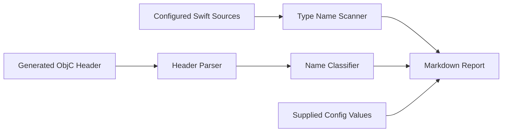

# kmprofiler

<p align="center">
  <a href="https://github.com/SiddhantPanhalkar/kmprofiler/actions/workflows/ci.yml"></a>
  <a href="https://opensource.org/licenses/Apache-2.0"></a>
  <a href="https://kotlinlang.org"></a>
  <a href="https://gradle.org"></a>
  <a href="CONTRIBUTING.md"></a>
  
</p>

<p align="center">
  <b>A Gradle plugin for auditing Kotlin Multiplatform iOS export surfaces.</b><br>
  Inspect the generated Objective-C API and find declarations that deserve a closer look.
</p>

---

## The problem

Public Kotlin declarations can become part of the Objective-C API generated for an iOS framework. As
a project grows, the generated header can include application types, Kotlin file facades, and types
exposed through library APIs.

Reviewing that surface manually is difficult:

1. The generated header can contain hundreds of declarations.
2. Kotlin-only implementation details may remain public by accident.
3. Library-looking names can be mixed with application declarations.
4. Raw framework or XCFramework size does not show the final application-size effect of one exported
   declaration.

`kmprofiler` reads the generated Objective-C header and scans the Swift source directories you
configure. It produces a review list from standalone declaration-name matches in those files.

This is not dead-code analysis. A declaration may still be used by Kotlin or Objective-C code,
dependency injection, reflection, another target, generated code, or a public Kotlin API
relationship.

---

## Architecture



The report distinguishes parsed facts from naming heuristics:

- Header declarations and member counts come from the generated header.
- Swift references are standalone declaration-name tokens found outside comments and strings.
- Member names alone do not count as references because a text scan cannot establish their receiver
  type.
- File-facade and possible external-module groups are naming hints, not proof of source ownership.

---

## Quickstart

### 1. Add the plugin to your version catalog

```toml
[versions]
kmprofiler = "0.1.1"

[plugins]
kmprofiler = { id = "io.github.siddhantpanhalkar.kmprofiler", version.ref = "kmprofiler" }
```

### 2. Apply it in the shared KMP module

```kotlin
plugins {
    alias(libs.plugins.kmprofiler)
}

kmprofiler {
    headerFile.set(
        layout.buildDirectory.file(
            "bin/iosArm64/releaseFramework/Shared.framework/Headers/Shared.h"
        )
    )
    swiftSourceDirs.setFrom(layout.projectDirectory.dir("../iosApp"))

    isStatic.set(true)
    exportedFrameworkCount.set(1)
    externalPrefixes.addAll("Skiko", "Models")
}
```

### 3. Build the framework and run the audit

```bash
./gradlew linkReleaseFrameworkIosArm64
./gradlew analyzeKmprofiler
```

The report is printed to the console and written to `build/reports/kmprofiler-report.md` in the
module where the plugin is applied.

The task does not run an iOS simulator or inspect a final application binary.

---

## Sample output

```markdown
### kmprofiler iOS Export Audit

**Export surface:** 259 declarations found in the generated Objective-C header.
**No standalone declaration-name token found for 244 declarations in the configured Swift sources.**

#### App-code review candidates (96)

| Declaration        | Kind     | Members | Scan result         |
|--------------------|----------|--------:|---------------------|
| `HomeViewModel`    | class    |      55 | no type token found |
| `FilterRecipe`     | class    |      13 | no type token found |
| `CameraController` | protocol |      16 | no type token found |

#### Kotlin file facade review candidates (13)

| Declaration      | Members | Scan result         |
|------------------|--------:|---------------------|
| `AppModuleKt`    |       7 | no type token found |
| `LutGeneratorKt` |       2 | no type token found |
```

Candidate counts depend on the generated header and configured Swift source roots. Treat each
candidate as a prompt for review, not as an instruction to change visibility.

The report also lists names that match the prefixes in `externalPrefixes` and records the linkage
and exported-framework values supplied in the configuration. These sections help with triage. They
do not prove library ownership or calculate the size of a declaration.

---

## Reviewing candidates safely

Before changing a candidate, check:

1. Whether it is intentionally part of the public Kotlin API.
2. Whether public and protected declarations accept, return, inherit, or expose it.
3. Whether `internal` still allows access from every required Kotlin source set.
4. Whether `private` is valid for the required Kotlin scope.
5. Whether a declaration-level `@HiddenFromObjC` is appropriate when Kotlin visibility must remain
   public.

After making a change, rebuild every affected Kotlin and iOS target, then rerun the audit.

`@HiddenFromObjC` is a declaration annotation. It cannot be applied as `@file:HiddenFromObjC`.

---

## Configuration reference

| Property                    | Type                         | Default        | Description                                                   |
|-----------------------------|------------------------------|----------------|---------------------------------------------------------------|
| `headerFile`                | `RegularFileProperty`        | Required       | Path to the generated Objective-C header, such as `Shared.h`. |
| `swiftSourceDirs`           | `ConfigurableFileCollection` | `iosApp/`      | Directories or Swift files included in the source scan.       |
| `frameworkBaseName`         | `Property<String>`           | `"Shared"`     | Framework base name supplied for project context.             |
| `isStatic`                  | `Property<Boolean>`          | Not configured | Linkage value displayed as supplied configuration.            |
| `exportedFrameworkCount`    | `Property<Int>`              | `1`            | Framework count displayed as supplied configuration.          |
| `externalPrefixes`          | `ListProperty<String>`       | Empty          | Name prefixes grouped for ownership review.                   |
| `allowEmptyConsumerSources` | `Property<Boolean>`          | `false`        | Allow a header-only audit when no Swift files are found.      |

By default, the task fails when it finds no Swift files. This prevents an incorrect source path from
silently turning every exported declaration into a review candidate. Set `allowEmptyConsumerSources`
to `true` only when you intentionally want a header-only audit.

---

## Scope and roadmap

- [x] **v0.1.0**: Initial Objective-C export-surface report.
- [x] **v0.1.1**: Safer export audit, token-aware Swift matching, scan provenance, and conservative
  review guidance.
- [ ] **v0.2.0**: Xcode link-map analysis for measured final-binary attribution.
- [ ] **Later**: Baseline comparison and CI regression policies.

---

## Development

```bash
./gradlew :plugin:test
./gradlew :plugin:publishToMavenLocal
```

See the sample project in [`sample/`](sample/) for a minimal setup.

---

## License and contributing

Licensed under the Apache License, Version 2.0. See [LICENSE](LICENSE) for details.

Contributions are welcome. Open an issue or submit a pull request with a focused change and
corresponding tests.
