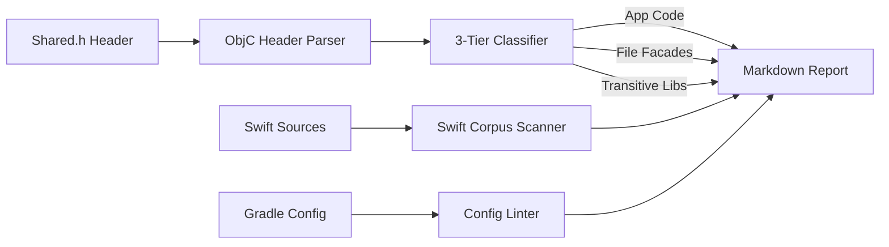

# kmprofiler

<p align="center">
  <a href="https://github.com/SiddhantPanhalkar/kmprofiler/actions/workflows/ci.yml"></a>
  <a href="https://opensource.org/licenses/Apache-2.0"></a>
  <a href="https://kotlinlang.org"></a>
  <a href="https://gradle.org"></a>
  <a href="CONTRIBUTING.md"></a>
</p>

<p align="center">
  <b>A zero-fabrication Gradle plugin that profiles Kotlin Multiplatform iOS export surfaces.</b><br>
  Exposes dead ObjC adapters, classifies leaked transitive library symbols, and lints framework configurations.
</p>

---

## 💡 The Problem

Every `public` Kotlin declaration compiled into an iOS `.framework` or `.xcframework` gets wrapped
in an Objective-C adapter. In production KMP apps:

* **Over 60%** of exported declarations often have **zero direct Swift call sites**.
* Transitive libraries (Compose UI, Skiko, Ktor, Koin, RevenueCat) leak hundreds of internal wrapper
  types into your ObjC bridging header.
* Standard tooling either fabricates non-existent byte estimates or provides no visibility at all.

`kmprofiler` analyses the exact bridging header against your Swift source code and categorises the
surface into actionable insights.

---

## ⚡ Architecture



---

## 📦 Quickstart

### 1. Add to Version Catalog (`gradle/libs.versions.toml`)

```toml
[versions]
kmprofiler = "0.1.0"

[plugins]
kmprofiler = { id = "io.github.siddhantpanhalkar.kmprofiler", version.ref = "kmprofiler" }
```

### 2. Apply in your shared KMP module (`build.gradle.kts`)

```kotlin
plugins {
    alias(libs.plugins.kmprofiler)
}

kmprofiler {
    headerFile.set(
        layout.buildDirectory.file("bin/iosArm64/releaseFramework/Shared.framework/Headers/Shared.h")
    )
    swiftSourceDirs.setFrom(layout.projectDirectory.dir("../iosApp"))
    isStatic.set(true)
    exportedFrameworkCount.set(1)
}
```

### 3. Run Profile

```bash
# 1. Build your framework first
./gradlew linkReleaseFrameworkIosArm64

# 2. Run the profiler
./gradlew analyzeKmprofiler
```

Output is printed to the console and saved to `build/reports/kmprofiler-report.md`.

---

## 📊 Sample Output

```markdown
### 📊 KMP iOS Export Profile — v0.1

**Export surface:** 459 Kotlin declarations exported to Objective-C.
**No direct Swift call site found for 282 of them.**

#### Your code — review candidates (18)

No direct call site found in scanned Swift sources.

| Declaration | Kind | Members |
|---|---|---|
| `HomeScreenCallbacks` | class | 23 |
| `CameraState` | class | 16 |
| `FilterRecipe` | class | 13 |
| `SubscriptionStatus` | class | 6 |
| `HomeUiState` | protocol | 0 (empty) |

#### Kotlin file facades — review candidates (18)

These `*Kt` classes wrap Kotlin top-level functions (e.g. `ColorKt` wraps `Color.kt`).
Add `@file:HiddenFromObjC` at the top of the Kotlin source file to eliminate them.

| Declaration | Members |
|---|---|
| `DimensKt` | 38 |
| `ColorKt` | 36 |
| `TypeKt` | 19 |

#### Likely library internals — 95 declarations

Transitive library symbols matching Kotlin/Native cross-module name mangling (`Ktor_`, `Koin_`,
`Ui_`).
Cannot be hidden with `internal` — remove via `transitiveExport = false` or trim `export()`
dependencies.

#### Config

- ℹ️ `transitiveExport` — not explicitly set (defaults to `false`).
- ℹ️ `isStatic = true` — app-linker dead-stripping applies; raw framework size substantially
  overstates app delta.
- ✅ Single exported framework; no cross-framework type duplication detected.
```

---

## 🛠️ Configuration Reference

| Property                 | Type                         | Default    | Description                                                                  |
|--------------------------|------------------------------|------------|------------------------------------------------------------------------------|
| `headerFile`             | `RegularFileProperty`        | *Required* | Path to the generated ObjC header (`Shared.h`).                              |
| `swiftSourceDirs`        | `ConfigurableFileCollection` | `iosApp/`  | Directories scanned recursively for `.swift` call sites.                     |
| `frameworkBaseName`      | `Property<String>`           | `"Shared"` | Name defined in `binaries.framework { baseName = ... }`.                     |
| `isStatic`               | `Property<Boolean>`          | `null`     | Match `binaries.framework { isStatic = ... }`. Used for config linting.      |
| `exportedFrameworkCount` | `Property<Int>`              | `1`        | Count of exported frameworks. Flags multi-binary duplication if > 1.         |
| `externalPrefixes`       | `ListProperty<String>`       | `[]`       | Custom prefixes to treat as external libraries (e.g. `"Skiko"`, `"Models"`). |

---

## 🎯 Roadmap

- [x] **v0.1.0** — ObjC export surface profiling, 3-tier classification, static config linting.
- [ ] **v0.2.0** — Xcode Link Map parser (`--link-map`) for true app-binary linked byte attribution.
- [ ] **v0.3.0** — Baseline export diffing & CI regression gating.

---

## 📄 License

Licensed under the Apache License, Version 2.0. See [LICENSE](LICENSE) for details.
